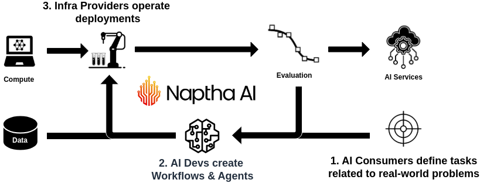

             %
             %%
             %%#
             %-+%
           %%%+.#
         #%#%.*=-%#
       #%=.%+-*%-:%%
      %%#*.*.#--%--*=%
     #%*%*.*.+- +-:%*%#     ███╗   ██╗ █████╗ ██████╗ ████████╗██╗  ██╗ █████╗ 
    #@:= *.%::#+:%%.=.%#    ████╗  ██║██╔══██╗██╔══██╗╚══██╔══╝██║  ██║██╔══██╗
     %%:*#.#*:*%=:*:=%%     ██╔██╗ ██║███████║██████╔╝   ██║   ███████║███████║
      %*-*:..=-%*:*:##      ██║╚██╗██║██╔══██║██╔═══╝    ██║   ██╔══██║██╔══██║
       ##+*--+-%=#+##       ██║ ╚████║██║  ██║██║        ██║   ██║  ██║██║  ██║
        #%#+=+=%*%%#        ╚═╝  ╚═══╝╚═╝  ╚═╝╚═╝        ╚═╝   ╚═╝  ╚═╝╚═╝  ╚═╝
          #%#%#%%#                             Decentralized Task Orchestration   
                                                                  www.naptha.ai

# Naptha Python SDK

Naptha helps users to solve real-world problems using AI workflows and agents. There are
3 different types of users:

1. AI Consumers define tasks related to real-world problems via the Task Marketplace.
2. Workflow Planners (likely AI developers) manage workflows and agents for rewards.
3. Platform Operators use our AI nodes to deploy and operate workflows and agents as AI services.

Decentralized workflows can run on one or more nodes (rather than on one central server) with many local data sources, opening up new use cases. 



## Install

```
pip install naptha-sdk
```

## Get Started

### Create an Account

Create an account on the [Hub](https://hub.naptha.ai/) and buy a Naptha subscription on the [Nevermined app](https://nevermined.app/en/subscription/did:nv:2dbfb9f940fec8baf39abf599b7d0a6a1f5bb117f5d3ae85d94a81fee04d2427) ($1 for 1000 credits).

```
naptha credits
```

## Task Marketplace

### Browse existing Tasks

You can browse all tasks using:

```
naptha tasks
```

### Browse existing RFPs

You can browse all RFPs using:

```
naptha rfps
```

## Nodes

### Explore Nodes on the Network

You can use the CLI to see a list of available nodes:

```
naptha nodes
```

And their pricing plans:

```
naptha services
```

Make note of a Node ID for running a workflow below.

### Check out available Modules

Navigate to the Modules page on the NapthaAI [Hub](https://hub.naptha.ai/). 

Modules can be workflow, agents or multi-agent systems. Modules typically involve one or more LLMs, along with humans in the loop. Nodes can set a price for running modules.

You can also use the CLI to explore available modules that you can run on nodes:

```
naptha modules
```

### Create your own Module

(Coming Soon)

### Run a Module

Once you've found a nodes and a worklfow you'd like to run, you can run and view the results. 

You can use the commandline tool to connect with the node and run the workflow (replace the node ID with a real node ID found on the Hub).

```
# usage: naptha run <coworker_id> <coop_id> <coop args>
naptha run node:58d8iv526jr6fbxlndrw chat_coop --prompt "what is the capital of france?"
```

# Run a Node

You can run your own Naptha node, and earn rewards for running workflows. Follow the instructions at https://github.com/NapthaAI/node