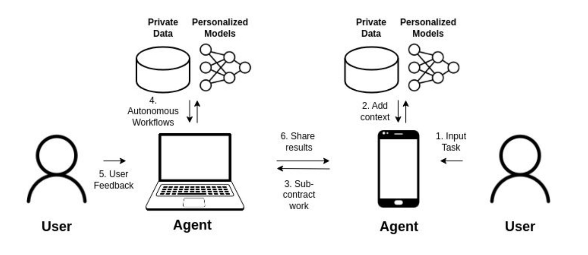

                 █▀█                  
              ▄▄▄▀█▀            
              █▄█ █    █▀█        
           █▀█ █  █ ▄▄▄▀█▀      
        ▄▄▄▀█▀ █  █ █▄█ █ ▄▄▄       
        █▄█ █  █  █  █  █ █▄█        ███╗   ██╗ █████╗ ██████╗ ████████╗██╗  ██╗ █████╗ 
     ▄▄▄ █  █  █  █  █  █  █ ▄▄▄     ████╗  ██║██╔══██╗██╔══██╗╚══██╔══╝██║  ██║██╔══██╗
     █▄█ █  █  █  █▄█▀  █  █ █▄█     ██╔██╗ ██║███████║██████╔╝   ██║   ███████║███████║
      █  █   ▀█▀  █▀▀  ▄█  █  █      ██║╚██╗██║██╔══██║██╔═══╝    ██║   ██╔══██║██╔══██║
      █  ▀█▄  ▀█▄ █ ▄█▀▀ ▄█▀  █      ██║ ╚████║██║  ██║██║        ██║   ██║  ██║██║  ██║
       ▀█▄ ▀▀█  █ █ █ ▄██▀ ▄█▀       ╚═╝  ╚═══╝╚═╝  ╚═╝╚═╝        ╚═╝   ╚═╝  ╚═╝╚═╝  ╚═╝
         ▀█▄ █  █ █ █ █  ▄█▀                             Orchestrating the Web of Agents
            ▀█  █ █ █ █ ▌▀                                                 www.naptha.ai
              ▀▀█ █ ██▀▀                                                    

 
# Naptha Python SDK

Naptha is a framework and infrastructure for developing and running multi-agent systems across many devices. The Naptha SDK is made up of:

1. A client for interacting with the Naptha Hub (like the huggingface_hug library but for multi-agent apps)
2. Abstractions for the composable building blocks of multi-agent apps like Agent, Orchestrator, Tool, Environment, Persona (i.e. Naptha Modules). With Naptha, communication between these modules happens via API.
3. Decorators for easily onboarding modules from agent frameworks like CrewAI.
3. A CLI for interacting with the Naptha Hub and Node

If you find this repo useful, please don't forget to star ⭐!



## Pre-requisites

Install Python [Poetry](https://python-poetry.org/docs/):

```bash
pipx install poetry
```

## Install

From source:

```bash
git clone https://github.com/NapthaAI/naptha-sdk.git
cd naptha-sdk
poetry install
poetry shell
```

Create a copy of the .env file:

```bash
cp .env.example .env
```

Choose whether you want to interact with a local Naptha node or a hosted Naptha node. For a local node, set ```NODE_URL=http://localhost:7001``` in the .env file. To use a hosted node, set ```NODE_URL=http://node.naptha.ai:7001``` or ```NODE_URL=http://node1.naptha.ai:7001```.

## Get Started

## Sign In or Sign Up

If you have already created an account on the Naptha Hub, you can add the details to HUB_USERNAME, HUB_PASSWORD and
PRIVATE_KEY in the .env file. If you don't have an account, you can either (a) add values for HUB_USERNAME, HUB_PASSWORD
and PRIVATE_KEY in the .env file and run `naptha signup`, or (b) run `naptha signup` without values in the .env file and
follow the instructions to create a username and password (in this case, the public/private keypair is randomly
generated, and all details will be saved in the .env file).

## Nodes

### Explore Nodes on the Network

You can use the CLI to see a list of available nodes:

```bash
naptha nodes
```

Make note of a Node ID for running a workflow below.

## Agents

### Interact with the Agent Hub

You can also use the CLI to explore available agents that you can run on a node:

```bash
naptha agents
```

For each agent, you will see a url where you can check out the code.

### Create a New Agent

```bash
naptha agents agent_name -p "description='Agent description' parameters='{tool_name: str, tool_input_data: str}' module_url='ipfs://QmNer9SRKmJPv4Ae3vdVYo6eFjPcyJ8uZ2rRSYd3koT6jg'" 
```

### Delete an Agent

```bash
naptha agents -d agent_name
```

### Run an Agent

Now you've found a node and a agent you'd like to run, so let's run it locally! You can use the commandline tool to connect with the node and run the workflow. 

```bash
# usage: naptha run <agent_name> <agent args>
naptha run agent:hello_world_agent -p "firstname=sam surname=altman"
```

Try an agent that uses the local LLM running on your node:

```bash
naptha run agent:simple_chat_agent -p "tool_name='chat' tool_input_data='what is an ai agent?'"
```

You can also run agents from docker images (if running your own node, make sure the DOCKER_JOBS=True in the config):

```bash
naptha run docker_hello_world -p "docker_image=hello-world"
```

## Agent Orchestrators

### Interact with the Agent Orchestrator Hub

You can also use the CLI to explore available agent orchestrators that you can run on a network of nodes:

```bash
naptha orchestrators
```

For each orchestrator, you will see a url where you can check out the code.

### Create a New Agent Orchestrator

```bash
naptha orchestrators orchestrator_name -p "description='Orchestrator description' parameters='{input_parameter_1: str, input_parameter_2: int}' module_url='ipfs://QmNer9SRKmJPv4Ae3vdVYo6eFjPcyJ8uZ2rRSYd3koT6jg'" 
```

### Delete an Agent Orchestrator

```bash
naptha orchestrators -d orchestrator_name
```

### Run an Agent Orchestrator across a network of nodes:

You can download and install the modules for an orchestrator without running first using:

```bash
naptha create orchestrator:multiagent_chat --agent_modules "agent:simple_chat_agent,agent:simple_chat_agent" --worker_node_urls "http://node.naptha.ai:7001,http://node1.naptha.ai:7001" --environment_modules "environment:groupchat_environment" --environment_node_urls "http://node.naptha.ai:7001"
```

You can run the orchestrator module on hosted nodes using:

```bash
naptha run orchestrator:multiagent_chat -p "prompt='i would like to count up to ten, one number at a time. ill start. one.'" --worker_node_urls "http://node.naptha.ai:7001,http://node1.naptha.ai:7001" --environment_node_urls "http://node.naptha.ai"
```

Or on local nodes:

```bash
naptha run orchestrator:multiagent_chat -p "prompt='i would like to count up to ten, one number at a time. ill start. one.'" --worker_node_urls "http://localhost:7001,http://localhost:7001" --environment_node_urls "http://localhost:7001"
```

```bash
naptha run orchestrator:babyagi -p "objective='Research the history of football'" --worker_node_urls "http://node.naptha.ai:7001,http://node1.naptha.ai:7001"
```

```bash
naptha run orchestrator:multiagent_debate -p "initial_claim='Teslas price will exceed $250 in 2 weeks.' max_rounds=2 context='Teslas current price is $207, and recent innovations and strong Q2 results will drive the price up.

News Summary 1:
Tesla stock was lower to start a new week of trading, falling as investors worry about global growth. Shares of the electric-vehicle giant were down 7.3% in premarket trading Monday at $192.33. Stocks around the world were falling as investors fretted that weak economic data signal a recession ahead. Despite positive comments from CEO Elon Musk about Tesla’s sales, the stock has fallen about 16% this year and is struggling to overcome negative global investor sentiment.

News Summary 2:
Tesla faces growing competition and softening demand, impacting its stock price which is trading 43% below its all-time high. The company’s profitability is declining, with earnings per share shrinking 46% year-over-year in Q2 2024. Despite recent price cuts and a plan to produce a low-cost EV model, sales growth has decelerated. Tesla is also involved in autonomous self-driving software, humanoid robots, and solar energy, but these segments may take years to significantly impact revenue.
'" --worker_node_urls "http://node.naptha.ai:7001"
```

## Environment Modules

Environment modules in Naptha provide shared state and communication infrastructure for multi-agent workflows. They act as a common space where agents can interact, share information, and maintain persistent state across workflow executions. Think of them as the "world" or "environment" in which agents operate and communicate.

For example, an environment module might:
- Maintain a shared conversation history for a group chat
- Store and manage a knowledge base that multiple agents can read from and write to
- Provide a shared task queue for coordinating work between agents
- Manage game state for multi-agent simulations

### Interact with the Environment Hub

You can also use the CLI to explore available environments that you can use with orchestrators:

```bash
naptha environments
```

### Create a New Environment Module

```bash
naptha environments environment_name -p "description='Environment description' parameters='{input_parameter_1: str, input_parameter_2: int}' module_url='ipfs://QmNer9SRKmJPv4Ae3vdVYo6eFjPcyJ8uZ2rRSYd3koT6jg'" 
```

### Delete an Environment Module

```bash
naptha environments -d environment_name
```

### Run an Environment Module

```bash
naptha run environment:groupchat_environment -p "function_name='get_global_state'"
```

## Knowledge Base Modules

### Interact with the Knowledge Base Hub

You can also use the CLI to explore available knowledge bases that you can use with agents:

```bash
naptha kbs
```

### Register a New Knowledge Base Module on the Hub

```bash
naptha kbs kb_name -p "description='Knowledge Base description' parameters='{input_parameter_1: str, input_parameter_2: int}' module_url='ipfs://QmNer9SRKmJPv4Ae3vdVYo6eFjPcyJ8uZ2rRSYd3koT6jg'" 
```

### Delete a Knowledge Base Module

```bash
naptha kbs -d kb_name
```

### Create a New Knowledge Base on a Node

```bash
naptha create kb:wikipedia_kb 
```

### Initialize the content in the Knowledge Base

```bash
naptha run kb:wikipedia_kb -p "mode='init'"
```

### List content in the Knowledge Base

```bash
naptha kbs wikipedia_kb -l
```

### Add to the Knowledge Base

```bash
naptha kbs wikipedia_kb -a -c "url='https://en.wikipedia.org/wiki/Socrates' title='Socrates' text='Socrates was a Greek philosopher from Athens who is credited as the founder of Western philosophy and as among the first moral philosophers of the ethical tradition of thought.'" 
```

### Query the Knowledge Base Module

```bash
naptha run kb:wikipedia_kb -p "mode='query' query='Socrates'"
```

### Run an Agent that interacts with the Knowledge Base

```bash
naptha run agent:wikipedia_agent -p "query='Socrates' question='Who is Socrates?'" --kb_node_urls "http://localhost:7001"
```

## Personas

### Interact with the Persona Hub

You can also use the CLI to explore available personas that you can use with agents:

```bash
naptha personas
```

For each persona, you will see a url where you can check out the data.

### Create a New Persona

```bash
naptha personas persona_name -p "description='Persona description' module_url='ipfs://QmNer9SRKmJPv4Ae3vdVYo6eFjPcyJ8uZ2rRSYd3koT6jg'" 
```

### Delete a Persona

```bash
naptha personas -d persona_name
```

## Inference 

```bash
naptha inference "How can we create scaling laws for multi-agent systems?" -m "phi3:mini"
```

## Interact with Node Storage

After the agent runs finish, you can download the file from the node using:

```bash
naptha read_storage -id <agent_run_id>
```

You can write to the node using:

```bash
naptha write_storage -i files/<filename>.jpg
```

### Interact with IPFS thorugh Node
```bash
naptha write_storage -i files/<filename>.jpg --ipfs
```


# ***More examples and tutorials coming soon.***

### Create your own Agent

Clone the [base template](https://github.com/NapthaAI/module_template) for creating agent and flow agents, and follow the instructions in the readme for prototyping the agent. You can check out other examples of agents and networks at https://github.com/NapthaAI.

Register your agent on the Naptha Hub (Coming Soon).

# Run a Node

You can run your own Naptha node, and earn rewards for running workflows. Follow the instructions at https://github.com/NapthaAI/node (still private, please reach out if you'd like access).
# Community

### Links

* Check out our [Website](https://www.naptha.ai/)  
* Contribute to our [GitHub](https://github.com/NapthaAI)
* Request to join the Naptha community on [HuggingFace](https://huggingface.co/NapthaAI)
* Follow us on [Twitter](https://twitter.com/NapthaAI) and [Farcaster](https://warpcast.com/naptha)  
* Subscribe to our [YouTube](https://www.youtube.com/channel/UCoDwQ3DZa1bRJPrIz_4_02w)

### Bounties and Microgrants

Have an idea for a cool use case to build with our SDK? Get in touch at team@naptha.ai.