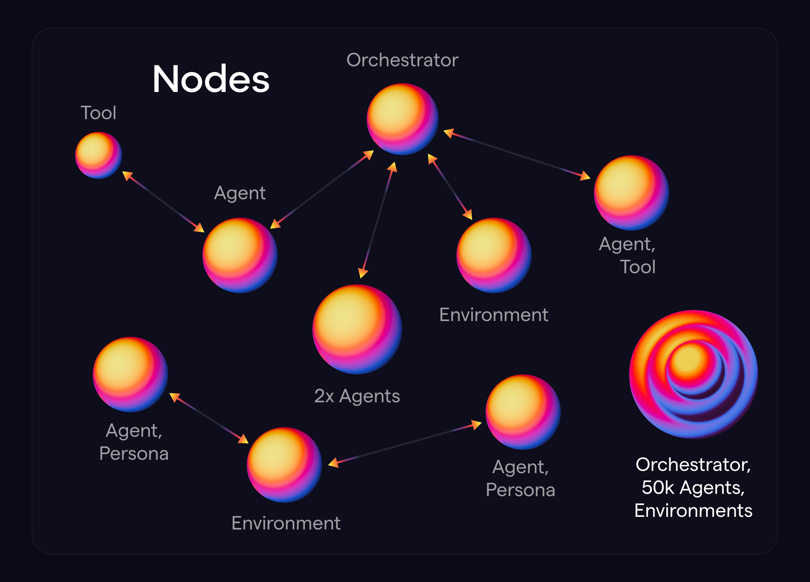

[](https://naptha.ai/?utm_source=github_sdk) [](https://form.typeform.com/to/Cgiz63Yp?utm_source=github_sdk)

                 █▀█                  
              ▄▄▄▀█▀            
              █▄█ █    █▀█        
           █▀█ █  █ ▄▄▄▀█▀      
        ▄▄▄▀█▀ █  █ █▄█ █ ▄▄▄       
        █▄█ █  █  █  █  █ █▄█        ███╗   ██╗ █████╗ ██████╗ ████████╗██╗  ██╗ █████╗ 
     ▄▄▄ █  █  █  █  █  █  █ ▄▄▄     ████╗  ██║██╔══██╗██╔══██╗╚══██╔══╝██║  ██║██╔══██╗
     █▄█ █  █  █  █▄█▀  █  █ █▄█     ██╔██╗ ██║███████║██████╔╝   ██║   ███████║███████║
      █  █   ▀█▀  █▀▀  ▄█  █  █      ██║╚██╗██║██╔══██║██╔═══╝    ██║   ██╔══██║██╔══██║
      █  ▀█▄  ▀█▄ █ ▄█▀▀ ▄█▀  █      ██║ ╚████║██║  ██║██║        ██║   ██║  ██║██║  ██║
       ▀█▄ ▀▀█  █ █ █ ▄██▀ ▄█▀       ╚═╝  ╚═══╝╚═╝  ╚═╝╚═╝        ╚═╝   ╚═╝  ╚═╝╚═╝  ╚═╝
         ▀█▄ █  █ █ █ █  ▄█▀                             Orchestrating the Web of Agents
            ▀█  █ █ █ █ ▌▀                                                 www.naptha.ai
              ▀▀█ █ ██▀▀                                                    

 
# Naptha Python SDK  [](https://pypi.org/project/naptha-sdk/) [](https://docs.naptha.ai/?utm_source=github_sdk)

Naptha is a framework and infrastructure for developing and running multi-agent systems at scale with heterogeneous models, architectures and data. 

Naptha Modules are the building blocks of multi-agent systems. They are designed to be framework-agnostic, allowing developers to implement modules using different agent frameworks. There are currently seven types of modules: Agents, Tools, Knowledge Bases, Memories, Orchestrators, Environments, and Personas. As shown in the diagram below, modules can also run on separate devices, while still interacting with each other the network.

The Naptha SDK is used within Naptha Modules to facilitate interactions with other modules, and to access model inference and storage (e.g. of knowledge, memories, etc.). The Naptha SDK also acts as a client for interacting with the Naptha Hub (like HuggingFace but for multi-agent apps), and Naptha Nodes (the infrastructure that runs modules).

You can find more information on Naptha Modules, the Naptha SDK and Naptha Nodes in the [docs](https://docs.naptha.ai).

If you find this repo useful, please don't forget to star ⭐!




- [🧩 Naptha Python SDK](#naptha-python-sdk)
  - [🏗 Installing the SDK](#-installing-the-sdk)
  - [🔥 Creating your Naptha Identity](#-creating-your-naptha-identity)
  - [⚙️ Configuring your env file](#-configuring-your-env-file)
  - [🌐 Interacting with the Naptha Hub](#-interacting-with-the-naptha-hub)
  - [🚀 Running Modules](#-running-modules)
    - [🤖 Run an Agent](#-run-an-agent)
    - [🎭 Run an Agent with a Persona](#-run-an-agent-with-a-persona)
    - [🛠️ Run a Tool](#-run-a-tool)
    - [🔧 Run an Agent that uses a Tool](#-run-an-agent-that-uses-a-tool)
    - [📚 Run a Knowledge Base](#-run-a-knowledge-base)
    - [🧠 Run an Agent that uses a Knowledge Base](#-run-an-agent-that-uses-a-knowledge-base)
    - [💭 Run a Memory Module](#-run-a-memory-module)
    - [🎮 Run an Orchestrator](#-run-an-orchestrator)
  - [✨ Creating your own Module](#-creating-your-own-module)
  - [💻 Running Agents locally on your own Naptha Node](#-running-agents-locally-on-your-own-naptha-node)
  - [👥 Community](#-community)
    - [🔗 Links](#-links)
    - [💰 Bounties and Microgrants](#-bounties-and-microgrants)

## 🧩 Installing the SDK

### Set up a Virtual Environment

It is good practice to install the SDK in a dedicated virtual environment. We recommend using Poetry to manage your dependencies.

Create a new poetry virtual environment:

```bash
poetry new test-env
source .venv/bin/activate
pip install naptha-sdk
```

You can also use in-built Python virtual environments:

```bash
python -m venv test-env
source test-env/bin/activate
```

### Install using PyPI

You can install the Naptha SDK using:

```bash
pip install naptha-sdk
```

## 🔥 Creating Your Naptha Identity

Your Naptha account is your identity on the Naptha platform. It allows you to:

- Deploy and run agents, tools, environments and other modules on Naptha Nodes (via a public/private keypair)
- Access and interact with the Naptha Hub's features and services (via a username and password)

The simplest way to create a new account is through the interactive CLI. Run the following command:

```bash
naptha signup
```

Or if you have already have set up an identity, edit your `.env` file with your desired credentials:

```bash
# .env file
HUB_USERNAME=your_username
HUB_PASSWORD=your_password
PRIVATE_KEY=your_private_key  # Optional - will be generated if not provided
```

## ⚙️ Configuring your env file

Create a copy of the .env file:

```bash
cp .env.example .env
```

Choose whether you want to interact with a *local* or *hosted* Naptha node. For a local node, set ```NODE_URL=http://localhost:7001``` in the .env file. To use a hosted node, set e.g. ```NODE_URL=https://node.naptha.ai``` or ```NODE_URL=https://node2.naptha.ai``` in the .env file.

## 🌐 Interacting with the Naptha Hub

You can use the CLI to see a list of available nodes:

```bash
naptha nodes
```

To see a list of existing agents on the hub you can run:

```bash
naptha agents
```

or  `naptha tools`, `naptha kbs`, `naptha memories`, `naptha orchestrators`, `naptha environments`, and `naptha personas` for other types of modules. For each agent, you will see a module url where you can check out the code.

For instructions on registering a new module on the hub, or updating and deleting modules see the [docs](https://docs.naptha.ai/GettingStarted/NapthaCLI).

## 🚀 Running Modules

Now you've found a module you want to run, and you've configured where you want to run the modules (either on a hosted node or locally). You can now use the CLI and run the module. 

### 🤖 Run an Agent

The [Hello World Agent](https://github.com/NapthaAI/hello_world_agent) is the simplest example of an agent that prints hello:

```bash
# usage: naptha run <agent_name> <agent args>
naptha run agent:hello_world_agent -p "firstname=sam surname=altman"
```

Try running the [Simple Chat Agent](https://github.com/NapthaAI/simple_chat_agent) that uses the local LLM running on your node:

```bash
naptha run agent:simple_chat_agent -p "tool_name='chat' tool_input_data='what is an ai agent?'"
```

You can check out the module code to see how to access model inference, via the Inference API of the Naptha Node. The `llm_configs.json` file in the `configs` folder of the module contains the model configurations:

```json
[
    {
        "config_name": "open",
        "client": "ollama",
        "model": "hermes3:8b",
        "temperature": 0.7,
        "max_tokens": 1000,
        "api_base": "http://localhost:11434"
    },
    {
        "config_name": "closed",
        "client": "openai",
        "model": "gpt-4o-mini",
        "temperature": 0.7,
        "max_tokens": 1000,
        "api_base": "https://api.openai.com/v1"
    }
]
```

The main code for the agent is contained in the `run.py` file, which imports the `InferenceClient` class and calls the `run_inference` method:

```python
from naptha_sdk.inference import InferenceClient

class SimpleChatAgent:
    def __init__(self, deployment: AgentDeployment):
        ...
        # the arg is loaded from configs/deployment.json
        self.node = InferenceClient(self.deployment.node) 
        ...

    async def chat(self, inputs: InputSchema):
        ...
        response = await self.node.run_inference({"model": self.deployment.config.llm_config.model,
                                                    "messages": messages,
                                                    "temperature": self.deployment.config.llm_config.temperature,
                                                    "max_tokens": self.deployment.config.llm_config.max_tokens})
```

### 🎭 Run an Agent with a Persona

Below are examples of running the Simple Chat Agent with a [twitter/X persona](https://huggingface.co/datasets/NapthaAI/twitter_personas/blob/main/interstellarninja.json), generated from exported X data:

```bash
naptha run agent:simple_chat_agent -p "tool_name='chat' tool_input_data='who are you?'" --persona_modules "interstellarninja_twitter"
```

and from a synthetically generated [market persona](https://huggingface.co/datasets/NapthaAI/market_agents_personas/blob/main/market_agents_personas/data/Aileen_May.yaml) based on census data:

```bash
naptha run agent:simple_chat_agent -p "tool_name='chat' tool_input_data='who are you?'" --persona_modules "marketagents_aileenmay"
```

### 🛠️ Run a Tool

The [Generate Image Tool](https://github.com/NapthaAI/generate_image_tool) is a simple example of a Tool module. It is intended to demonstrate how agents can interact with a Tool module that allows them to generate images. You can run the tool module using:

```bash
# usage: naptha run <tool_name> -p "<tool args>"
naptha run tool:generate_image_tool -p "tool_name='generate_image_tool' prompt='A beautiful image of a cat'"
```

### 🔧 Run an Agent that uses a Tool

The [Generate Image Agent](https://github.com/NapthaAI/generate_image_agent) is an example of an Agent module that interacts with the [Generate Image Tool](https://github.com/NapthaAI/generate_image_tool). You can run the agent module using:

```bash
naptha run agent:generate_image_agent -p "tool_name='generate_image_tool' prompt='A beautiful image of a cat'" --tool_nodes "node.naptha.ai"
```

The name of the tool subdeployment that the agent uses is specified in the `configs/deployment.json`, and the full details of that tool subdeployment are loaded from the deployment with the same name in the `configs/tool_deployments.json` file.

```json
// AgentDeployment in deployment.json file 
[
    {
        "node": {"name": "node.naptha.ai"},
        "module": {"name": "generate_image_agent"},
        "config": ...,
        "tool_deployments": [{"name": "tool_deployment_1"}],
        ...
    }
]

# ToolDeployment in tool_deployments.json file
[
    {
        "name": "tool_deployment_1",
        "module": {"name": "generate_image_tool"},
        "node": {"ip": "node.naptha.ai"},
        "config": {
            "config_name": "tool_config_1",
            "llm_config": {"config_name": "model_1"}
        },
    }
]
```

There is a `GenerateImageAgent` class in the `run.py` [file](https://github.com/NapthaAI/generate_image_agent/blob/main/generate_image_agent/run.py#L16), which imports the `Tool` class and calls the `Tool.run` method:

```python
from naptha_sdk.schemas import AgentDeployment, AgentRunInput, ToolRunInput
from naptha_sdk.modules.tool import Tool
from naptha_sdk.user import sign_consumer_id

class GenerateImageAgent:
    def __init__(self, deployment: AgentDeployment):
        ...
        # the arg below is loaded from configs/tool_deployments.json
        self.tool = Tool(tool_deployment=self.deployment.tool_deployments[0])
        ...

    async def call_tool(self, module_run: AgentRunInput):
        tool_run_input = ToolRunInput(
            consumer_id=module_run.consumer_id,
            inputs=module_run.inputs,
            deployment=self.deployment.tool_deployments[0],
            signature=sign_consumer_id(module_run.consumer_id, os.getenv("PRIVATE_KEY"))
        )

        tool_response = await self.tool.run(tool_run_input)
```

### 📚 Run a Knowledge Base

The [Wikipedia Knowledge Base Module](https://github.com/NapthaAI/wikipedia_kb/tree/main) is a simple example of a Knowledge Base module. It is intended to demonstrate how agents can interact with a Knowledge Base that looks like Wikipedia. 

The configuration of a knowledge base module is specified in the `deployment.json` file in the `configs` folder of the module.

```json
# KnowledgeBaseConfig in deployment.json file 
[
    {
        ...
        "config": {
            "llm_config": {"config_name": "model_1"},
            "storage_config": {
                "storage_type": "db",
                "path": "wikipedia_kb",
                "options": {
                    "query_col": "title",
                    "answer_col": "text"
                },
                "storage_schema": {
                    "id": {"type": "INTEGER", "primary_key": true},
                    "url": {"type": "TEXT"},
                    "title": {"type": "TEXT"},
                    "text": {"type": "TEXT"}
                }
            }
        }
    }
]
```

There is a WikipediaKB class in the `run.py` file that has a number of methods. You can think of these methods as [endpoints of the Knowledge Base](https://github.com/NapthaAI/wikipedia_kb/blob/main/wikipedia_kb/run.py#L59), which will be called using the `run` command below. For example, you can initialize the content in the Knowledge Base using:

```bash
naptha run kb:wikipedia_kb -p "func_name='init'"
```

You can list content in the Knowledge Base using:

```bash
naptha run kb:wikipedia_kb -p '{
    "func_name": "list_rows",
    "func_input_data": {
        "limit": "10"
    }
}'
```

You can add to the Knowledge Base using:

```bash
naptha run kb:wikipedia_kb -p '{
    "func_name": "add_data",
    "func_input_data": {
        "url": "https://en.wikipedia.org/wiki/Socrates",
        "title": "Socrates",
        "text": "Socrates was a Greek philosopher from Athens who is credited as the founder of Western philosophy and as among the first moral philosophers of the ethical tradition of thought."
    }
}'
```

You can query the Knowledge Base using:

```bash
naptha run kb:wikipedia_kb -p '{
    "func_name": "run_query",
    "func_input_data": {
        "query": "Elon Musk"
    }
}'
```

You can delete a row from the Knowledge Base using:

```bash
naptha run kb:wikipedia_kb -p '{
    "func_name": "delete_row",
    "func_input_data": {
        "condition": {
            "title": "Elon Musk"
        }
    }
}'
```

You can delete the entire Knowledge Base using:

```bash
naptha run kb:wikipedia_kb -p '{
    "func_name": "delete_table",
    "func_input_data": {
        "table_name": "wikipedia_kb"
    }
}'
```

The Wikipedia KB also instantiates the `StorageClient` class and calls the `execute` method with `CreateStorageRequest`, `ReadStorageRequest`, `DeleteStorageRequest`, `ListStorageRequest` and `UpdateStorageRequest` objects:

```python
from naptha_sdk.schemas import KBDeployment
from naptha_sdk.storage.schemas import ReadStorageRequest
from naptha_sdk.storage.storage_client import StorageClient

class WikipediaKB:
    def __init__(self, deployment: KBDeployment):
        ...
        # the arg is loaded from configs/deployment.json
        self.storage_client = StorageClient(self.deployment.node)
        self.storage_type = self.config.storage_config.storage_type
        self.table_name = self.config.storage_config.path
        self.schema = self.config.storage_config.storage_schema

    async def run_query(self, input_data: Dict[str, Any], *args, **kwargs):
        read_storage_request = ReadStorageRequest(
            storage_type=self.storage_type,
            path=self.table_name,
            options={"condition": {"title": input_data["query"]}}
        )

        read_result = await self.storage_client.execute(read_storage_request)
```

### 🧠 Run an Agent that uses a Knowledge Base

You can run an Agent that interacts with the Knowledge Base using:

```bash
naptha run agent:wikipedia_agent -p "func_name='run_query' query='Elon Musk' question='Who is Elon Musk?'" --kb_nodes "node3.naptha.ai"
```

The name of the KB subdeployment that the agent uses is specified in the `configs/deployment.json`, and the full details of that KB subdeployment are loaded from the deployment with the same name in the `configs/kb_deployments.json` file.

```json
# AgentDeployment in configs/deployment.json file 
[
    {
        "node": {"name": "node.naptha.ai"},
        "module": {"name": "wikipedia_agent"},
        "config": ...,
        "kb_deployments": [{"name": "kb_deployment_1"}],
        ...
    }
]

# KBDeployment in configs/kb_deployments.json file
[
    {
        "name": "kb_deployment_1",
        "module": {"name": "wikipedia_kb"},
        "node": {"ip": "node.naptha.ai"},
        "config": {
            "llm_config": {"config_name": "model_1"},
            "storage_config": ...
        },
    }
]
```

There is a `WikipediaAgent` class in the `run.py` [file](https://github.com/NapthaAI/wikipedia_agent/blob/main/wikipedia_agent/run.py#L15), which imports the `KnowledgeBase` class and calls the `KnowledgeBase.run` method:

```python
from naptha_sdk.modules.kb import KnowledgeBase
from naptha_sdk.schemas import AgentDeployment, AgentRunInput, KBRunInput
from naptha_sdk.user import sign_consumer_id

class WikipediaAgent:
    def __init__(self, deployment: AgentDeployment):
        ...
        # the arg below is loaded from configs/kb_deployments.json
        self.wikipedia_kb = KnowledgeBase(kb_deployment=self.deployment.kb_deployments[0])
        ...

        kb_run_input = KBRunInput(
            consumer_id=module_run.consumer_id,
            inputs={"func_name": "run_query", "func_input_data": {"query": module_run.inputs.query}},
            deployment=self.deployment.kb_deployments[0],
            signature=sign_consumer_id(module_run.consumer_id, os.getenv("PRIVATE_KEY"))
        )

        page = await self.wikipedia_kb.run(kb_run_input)
```

### 💭 Run a Memory Module

The [Cognitive Memory module](https://github.com/NapthaAI/cognitive_memory) is a simple example of a Memory module. It is intended to demonstrate how agents can interact with a Memory module that allows them to store and retrieve cognitive steps such as reflections. You can create a memory table using:

The configuration of a memory module is specified in the `deployment.json` file in the `configs` folder of the module.

```json
# MemoryConfig in configs/deployment.json file 
[
    {
        ...
        "config": {
            "storage_config": {
                "storage_type": "db",
                "path": "cognitive_memory",
                "storage_schema": {
                    "memory_id": {"type": "INTEGER", "primary_key": true},
                    "cognitive_step": {"type": "TEXT"},
                    "content": {"type": "TEXT"},
                    "created_at": {"type": "TEXT"},
                    "metadata": {"type": "jsonb"}
                },
                "options": {
                    "query_col": "title",
                    "answer_col": "text"
                }
            }
        }
    }
]
```

There is a CognitiveMemory class in the `run.py` file that has a number of methods. You can think of these methods as [endpoints of the Memory](https://github.com/NapthaAI/cognitive_memory/blob/main/cognitive_memory/run.py#L34), which will be called using the `run` command below. For example, you can initialize the table in Memory using:

```bash
naptha run memory:cognitive_memory -p "func_name='init'"
```

You can add to the memory table using:

```bash
naptha run memory:cognitive_memory -p '{
    "func_name": "store_cognitive_item",
    "func_input_data": {
        "cognitive_step": "reflection",
        "content": "I am reflecting."
    }
}'
```

You can query the memory table using:

```bash
naptha run memory:cognitive_memory -p '{
    "func_name": "get_cognitive_items",
    "func_input_data": {
        "cognitive_step": "reflection"
    }
}'
```

You can delete a row in the memory table using:

```bash
naptha run memory:cognitive_memory -p '{
    "func_name": "delete_cognitive_items",
    "func_input_data": {
        "condition": {"cognitive_step": "reflection"}
    }
}'
```

### 🎮 Run an Orchestrator 

The [Multiagent Chat Orchestrator](https://github.com/NapthaAI/multiagent_chat) is an example of an Orchestrator module that interacts with simple chat [Agent modules](https://github.com/NapthaAI/simple_chat_agent) and a groupchat [Knowledge Base module](https://github.com/NapthaAI/groupchat_kb). The orchestrator, agents and knowledge base can all run on different nodes. You can run the orchestrator module on hosted nodes using:

The names of the Agent and KB subdeployments that the orchestrator uses are specified in the `configs/deployment.json`, and the full details of those subdeployments are loaded from the deployments with the same name in the `configs/agent_deployments.json` and `configs/kb_deployments.json` files.

```json
# OrchestratorDeployment in configs/deployment.json file 
[
    {
        "node": {"name": "node.naptha.ai"},
        "module": {"name": "multiagent_chat"},
        "config": ...,
        "agent_deployments": [
            {"name": "agent_deployment_1"},
            {"name": "agent_deployment_2"}
        ],
        "kb_deployments": [{"name": "groupchat_kb_deployment_1"}]
        ...
    }
]

# AgentDeployments in configs/agent_deployments.json file
[
    {
        "name": "agent_deployment_1",
        "module": {"name": "simple_chat_agent"},
        "node": {"ip": "node.naptha.ai"},
        "config": {
            "config_name": "agent_config_1",
            "llm_config": {"config_name": "model_1"},
            "system_prompt": ...
        }
    },
    {
        "name": "agent_deployment_2",
        "module": {"name": "simple_chat_agent"},
        "node": {"ip": "node.naptha.ai"},
        "config": {
            "config_name": "agent_config_2",
            "llm_config": {"config_name": "model_2"},
            "system_prompt": ...
        }
    }
]

# KBDeployment in configs/kb_deployments.json file
[
    {
        "name": "groupchat_kb_deployment_1",
        "module": {"name": "groupchat_kb"},
        "node": {"ip": "node.naptha.ai"},
        "config": {
            "storage_config": ...
        },
    }
]
```

There is a `MultiAgentChat` class in the `run.py` [file](https://github.com/NapthaAI/multiagent_chat/blob/main/multiagent_chat/run.py#L24C7-L24C21), which imports the `Agent` and `KnowledgeBase` classes and calls the `Agent.run` and `KnowledgeBase.run` methods:

```python
from naptha_sdk.modules.agent import Agent
from naptha_sdk.modules.kb import KnowledgeBase
from naptha_sdk.schemas import OrchestratorRunInput, OrchestratorDeployment, KBRunInput, AgentRunInput
from naptha_sdk.user import sign_consumer_id

class MultiAgentChat:
    def __init__(self, deployment: OrchestratorDeployment):
        self.orchestrator_deployment = orchestrator_deployment
        self.agent_deployments = self.orchestrator_deployment.agent_deployments
        self.agents = [
            Agent(deployment=self.agent_deployments[0], *args, **kwargs),
            Agent(deployment=self.agent_deployments[1], *args, **kwargs)
        ]
        self.groupchat_kb = KnowledgeBase(kb_deployment=self.orchestrator_deployment.kb_deployments[0])

    async def run_multiagent_chat(self, module_run: OrchestratorRunInput):
        ...
        for round_num in range(self.orchestrator_deployment.config.max_rounds):
            for agent_num, agent in enumerate(self.agents):
                    agent_run_input = AgentRunInput(
                        consumer_id=module_run.consumer_id,
                        inputs={"tool_name": "chat", "tool_input_data": messages},
                        deployment=self.agent_deployments[agent_num],
                        signature=sign_consumer_id(module_run.consumer_id, os.getenv("PRIVATE_KEY"))
                    )
                    response = await agent.call_agent_func(agent_run_input)
```


You can run the orchestrator module using (note that using the `--agent_nodes` and `--kb_nodes` flags overrides the values in the `deployment.json` file instead):

```bash
# usage: naptha run <orchestrator_name> -p "<orchestrator args>" --agent_nodes "<agent nodes>" --kb_nodes "<kb nodes>"
naptha run orchestrator:multiagent_chat -p "prompt='i would like to count up to ten, one number at a time. ill start. one.'" --agent_nodes "node.naptha.ai,node1.naptha.ai" --kb_nodes "node.naptha.ai"
```

## ✨ Creating your own Module

Follow the guide in our [docs](https://docs.naptha.ai/Contributing/module-builder) for creating your first agent. This involves cloning the [base module template](https://github.com/NapthaAI/module_template). You can check out other examples of agents and other modules at https://github.com/NapthaAI.

# 💻 Running Agents locally on your own Naptha Node

You can run your own Naptha node, and earn rewards for running workflows. Follow the instructions at https://github.com/NapthaAI/naptha-node.

## 👥 Community

### 🔗 Links

* Check out our [Website](https://www.naptha.ai/)  
* Read our [Docs](https://docs.naptha.ai/)
* Contribute to our [GitHub](https://github.com/NapthaAI)
* Request to join the Naptha community on [HuggingFace](https://huggingface.co/NapthaAI)
* Follow us on [Twitter](https://twitter.com/NapthaAI) and [Farcaster](https://warpcast.com/naptha)  
* Subscribe to our [YouTube](https://www.youtube.com/channel/UCoDwQ3DZa1bRJPrIz_4_02w)

### 💰 Bounties and Microgrants

Have an idea for a cool use case to build with our SDK? Get in touch at team@naptha.ai.
